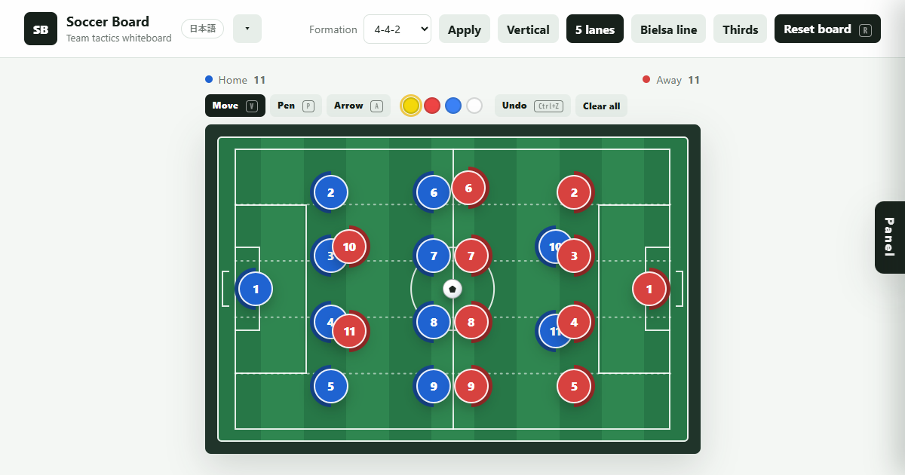

# Soccer Tactics Board

<p align="center">
  <a href="https://yynakayama.github.io/soccer-tactics-board/">
    
  </a>
</p>

<p align="center"><strong>A zero-install, browser-only soccer tactics whiteboard.</strong></p>

<p align="center">
  <a href="LICENSE"></a>
  <a href="https://yynakayama.github.io/soccer-tactics-board/"></a>
  <a href="https://yynakayama.github.io/soccer-tactics-board/"></a>
</p>

Drag players, draw arrows, switch formations and tactical guides — right in your browser.
No sign-up, no install, no build. Works offline and can be added to your home screen.

**▶ Live Demo: https://yynakayama.github.io/soccer-tactics-board/**

## Features

- **Formations** — apply 4-4-2, 4-3-3, 4-2-3-1 or 3-5-2 to the home side in one tap.
- **Drag to move** — reposition home players, opponents and the ball freely.
- **Draw** — pen and arrow tools with color swatches, undo and clear-all.
- **Tactical guides** — 5 lanes, Bielsa line and thirds (3 zones) overlays.
- **Roster management** — numbers, names, bench, substitutions and sent-off players.
- **Bilingual** — switch between English and Japanese on the fly.
- **Offline & installable** — a PWA that keeps working with no network and installs to your home screen.
- Your roster and layout are saved locally in the browser.

## Usage

Just open `index.html` in any modern browser — that's the whole setup.

Optionally, serve it locally:

```powershell
node dev-server.js
```

Then open `http://127.0.0.1:4173/`.

## Tech

Plain **HTML / CSS / JavaScript**. No framework, no bundler, no dependencies, no build step.
State is stored in `localStorage`, offline support is a small Service Worker, and all asset
references are relative so it works from a GitHub Pages sub-path.

## License

[MIT](LICENSE) © 2026 nakayama

---

# サッカー戦術ボード

**インストール不要・ブラウザだけで動くサッカー戦術ホワイトボード。**

選手をドラッグし、矢印を描き、フォーメーションや戦術ガイドを切り替え——すべてブラウザ内で完結します。
登録・インストール・ビルドは不要。オフラインでも動作し、ホーム画面に追加できます。

**▶ ライブデモ: https://yynakayama.github.io/soccer-tactics-board/**

## できること

- **フォーメーション反映** — 4-4-2 / 4-3-3 / 4-2-3-1 / 3-5-2 をワンタップで味方に反映。
- **ドラッグ移動** — 味方・相手・ボールを自由に配置。
- **描画** — ペン・矢印ツール（色の切替・1つ戻す・全消去）。
- **戦術ガイド** — 5レーン・ビエルサライン・3ゾーンのオーバーレイ。
- **選手管理** — 背番号・名前・控え・交代・退場。
- **英日切替** — 表示言語をその場で切り替え。
- **オフライン・インストール可** — ネットワークなしでも動く PWA。ホーム画面に追加できます。
- 味方登録と配置はブラウザのローカルに保存されます。

## 使い方

`index.html` をブラウザで開くだけで使えます。

ローカルサーバーで開く場合:

```powershell
node dev-server.js
```

その後、ブラウザで `http://127.0.0.1:4173/` を開きます。

## 技術

素の **HTML / CSS / JavaScript**。フレームワーク・バンドラ・依存パッケージ・ビルドは一切なし。
状態は `localStorage` に保存し、オフライン対応は小さな Service Worker で実現。
アセット参照はすべて相対パスなので、GitHub Pages のサブパス配信でも動作します。

## ライセンス

[MIT](LICENSE) © 2026 nakayama
